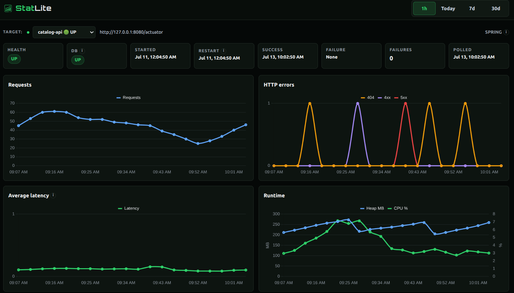

# StatLite

A tiny self-hosted metrics dashboard for small servers.



StatLite starts with an opinionated Spring Boot Actuator backend for small self-hosted deployments: local SQLite, raw samples only, simple charts, localhost dashboard by default, systemd-friendly, and no Prometheus/Grafana stack required.

**StatLite is not a Prometheus/Grafana replacement.** It is a small production-support tool for one-person / small-team self-hosted apps where Spring Boot Actuator already exposes enough useful data, but raw metric endpoints are too awkward to inspect manually.

## Quick Start

From a clone:

```bash
go build -o statlite ./cmd/statlite
./statlite
```

Open http://127.0.0.1:9090 — StatLite loads root `statlite.yaml` and monitors itself via `/healthz`.

The first self-monitor poll may fail briefly before the HTTP server is ready. That is expected; the dashboard should become healthy on the next poll rather than treating that initial failure as a permanent problem.

Edit `statlite.yaml` for the default single-target setup, or start from `examples/multi-target.yaml` if you want multiple targets in one instance.

See `examples/` for config templates:

| Config | Monitors |
|--------|----------|
| `examples/multi-target.yaml` | Generic multi-target starter (illustrative only) |
| `examples/actuator.yaml` | Spring Boot Actuator (single target) |
| `examples/statlite.yaml` | Another StatLite instance (self-monitoring) |
| `examples/spring-actuator-demo/` | Standalone Spring Boot demo app for StatLite monitoring |

### Installed binary

If StatLite is already on your `PATH` (release installer or Homebrew):

```bash
cp examples/actuator.yaml ./statlite.yaml   # or create your own config
# edit credentials and URLs
statlite --config ./statlite.yaml
```

Default config path is `statlite.yaml` in the current working directory when `--config` is omitted.

## Config

`statlite.yaml` is loaded by default. For production, point it at your app:

```bash
./statlite --config examples/actuator.yaml
```

The config may contain Actuator credentials — restrict the file with `chmod 600` on a server. Credentials are never rendered in the dashboard or API responses.

Details (targets, Basic Auth, storage, polling, self-monitoring, retention): [docs/configuration.md](docs/configuration.md).

## Deployment

The binary is self-contained. See [docs/install.md](docs/install.md) for install options and [docs/statlite.service.example](docs/statlite.service.example) for a starter systemd unit. Installers and package managers install **only the binary** — they do not create config, initialize storage, install units, or start services.

### Dashboard access

StatLite does not include built-in dashboard/API authentication yet.

By default, examples bind the server to `127.0.0.1:9090` so the dashboard is reachable only from the local machine. For remote access, use an SSH tunnel, VPN, firewall-restricted private network, or an authenticated reverse proxy.

You may bind to `0.0.0.0:9090` if you intentionally want StatLite to listen on all interfaces, but do this only when access is protected externally. Without external protection, anyone who can reach the port can view dashboard/API data such as target names and operational metrics.

## Version and health

```bash
statlite --version
```

`GET /healthz` returns JSON including the same version string.

Process health semantics:

* Top-level `status` and the HTTP status code describe **StatLite itself**, not whether monitored targets are healthy.
* Target poll failures appear under `statlite.polling` and do **not** mark the process unhealthy.
* If the local SQLite store fails its health check, `/healthz` reports `status: "error"` and HTTP 503.

`type: "statlite"` targets are for StatLite self-monitoring only. They are not a general stable metrics protocol for other applications.

## API stability

`/api/*` is early/internal and **not yet a stable public API**. Fields and routes may change without a compatibility guarantee.

Missing optional metrics may appear as `null` (or be omitted from charts) and should degrade cleanly rather than failing the whole dashboard.

## Known Limitations (MVP)

StatLite is early and intentionally limited:

* **Raw samples only** — no derived rollups or downsampling. Query-time delta computation is used for counters.
* **No alerts** — dashboard-only. No alert manager, no notifications.
* **No dashboard auth** — see [Dashboard access](#dashboard-access) for safe deployment options.
* **Spring Boot Actuator-first** — other metric backends (Prometheus, custom endpoints) are not supported in the MVP.
* **Credentials in config** — Actuator credentials live in the YAML file. Restrict with `chmod 600`.
* **Dashboard CDN assets** — Chart.js and fonts may load from external CDNs. The backend is a single binary; full dashboard rendering still depends on those external frontend assets for now. Vendoring them into the binary is a post-MVP item.

## License

MIT
