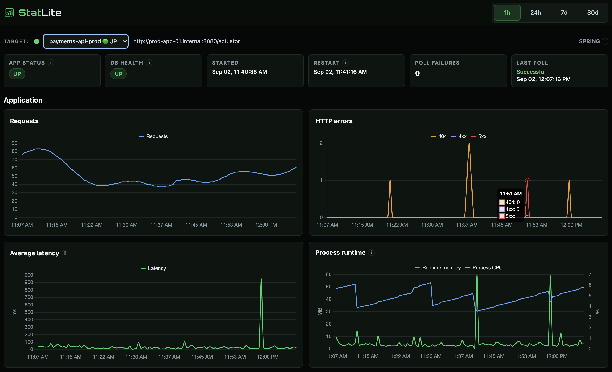

# StatLite

[](https://github.com/PVRLabs/statlite/stargazers)
[](https://github.com/PVRLabs/statlite/releases)
[](LICENSE)

A lightweight, self-hosted metrics dashboard with a small memory and operational
footprint, designed for applications running on VPSs and small servers. A single
Go binary monitors Spring Boot applications through Actuator and other
applications that expose [a small, fixed JSON metrics
endpoint](docs/statlite-metrics-v1.md), without requiring Prometheus or Grafana.
It stores focused health, traffic, latency, CPU, memory, and optional host metrics
in SQLite.

StatLite is designed for
[monitoring on resource-constrained servers](docs/low-resource-monitoring.md),
with low memory, CPU, disk, and operational overhead treated as product
constraints.

**Website:** [pvrlabs.xyz/statlite](https://pvrlabs.xyz/statlite)



Learn how to set up [lightweight Spring Boot monitoring without Prometheus and Grafana](https://pvrlabs.xyz/articles/lightweight-spring-boot-monitoring.html).

## Try it

```bash
docker run --rm \
  -p 127.0.0.1:9090:9090 \
  ghcr.io/pvrlabs/statlite:latest
```

Open <http://127.0.0.1:9090>. StatLite monitors itself by default, so the
dashboard starts with live data.

See the [Docker guide](docs/docker.md) for persistent storage, container
networking, local builds, and access guidance.

StatLite is intentionally focused and is not a replacement for Prometheus and
Grafana.

## Install

See [Installation](docs/install.md) for the release installer, Homebrew, and
source-build instructions.

## Configure an application

Point StatLite at a Spring Boot application's Actuator endpoint:

```yaml
targets:
  - name: "my-app"
    actuator_base_url: "http://localhost:8080/actuator"
```

See [Configuration](docs/configuration.md) for all settings and [`examples/`](examples/)
for Spring Boot, Python/FastAPI, self-monitoring, and multi-target configurations.

> [!IMPORTANT]
> StatLite has no built-in dashboard or API authentication. Review the
> [server and access guidance](docs/configuration.md#server) before exposing it
> remotely.

## Supported metric sources

- **Spring Boot Actuator:** Collects health, request, JVM, process, and optional
  host metrics from Actuator endpoints.
- **[StatLite Metrics v1](docs/statlite-metrics-v1.md):** A small, fixed JSON
  endpoint that applications in any language or framework can implement.
- **StatLite self-monitoring:** StatLite can report its own health, traffic,
  process, and host metrics.

Depending on the integration, StatLite can also collect CPU, memory, and disk
metrics for the environment running the application.

## Documentation

- [Installation](docs/install.md)
- [Docker](docs/docker.md)
- [Configuration](docs/configuration.md)
- [Monitoring on resource-constrained servers](docs/low-resource-monitoring.md)
- [StatLite Metrics v1](docs/statlite-metrics-v1.md)
- [systemd deployment](docs/systemd.md)
- [Product and architecture](docs/product.md)
- [Spring Boot guide](https://pvrlabs.xyz/articles/lightweight-spring-boot-monitoring.html)
- [Examples](examples/)

## License

MIT
