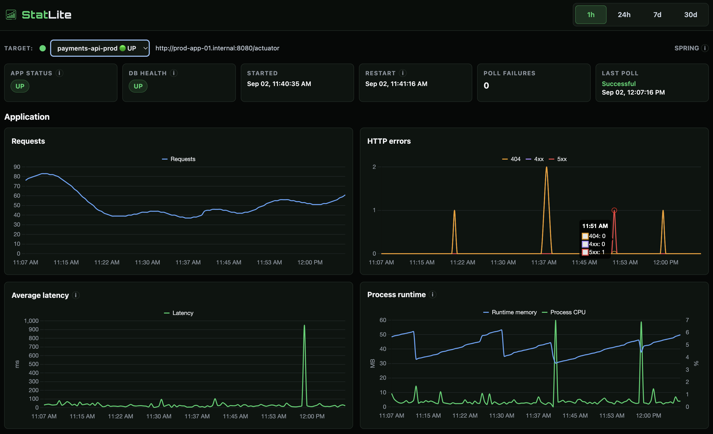

<h1>
  
  StatLite
</h1>

**StatLite** 是一款轻量级、自托管的 Spring Boot 监控工具，专为小型 VPS 和资源有限的
服务器而设计。单个 Go 二进制文件即可与应用一起运行，无需单独的监控服务器，
也不需要部署 Prometheus/Grafana。StatLite 注重低内存和 CPU 开销，为应用
留出更多资源。

一个 StatLite 实例会自动采集指标，持续监控多个已配置的应用。在仪表盘上切换
应用只会改变当前显示的目标，不会停止其他目标的采集。历史指标保存在本地
SQLite 中，可通过内置仪表盘查看；数据留在你自己的服务器上。

🌐 [官网](https://pvrlabs.xyz/statlite) · 👀 [在线演示](https://pvrlabs.xyz/statlite/demo.html) · [English README](README.md)

<p align="center">
  
  <br><sub>StatLite 监控 Spring Boot 应用的主仪表盘。</sub>
</p>

## 快速体验

```bash
docker run --rm \
  -p 127.0.0.1:9090:9090 \
  ghcr.io/pvrlabs/statlite:latest
```

打开 <http://127.0.0.1:9090>，StatLite 默认会监控自身，因此仪表盘启动后即有
实时数据。

## 完整文档

以下英文文档提供完整细节：

- [Installation](docs/install.md)
- [Configuration](docs/configuration.md)
- [Supported integrations](docs/integrations.md)
- [Docker](docs/docker.md)
- [Examples](examples/)

> 英文版 [README](README.md) 及其文档是权威且最新的信息来源。

---

[Improve this translation](https://github.com/PVRLabs/statlite/edit/main/README.zh-Hans.md)
