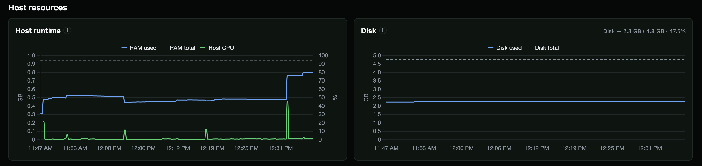

# Configuration

StatLite supports [Spring Boot Actuator](#spring-boot-actuator),
[Quarkus Micrometer metrics](#quarkus-micrometer-metrics), and
[Micronaut Micrometer metrics](#micronaut-micrometer-metrics) targets. Applications
can also expose the fixed [StatLite Metrics v1](statlite-metrics-v1.md) JSON
profile, with [ready-to-use integration guides](integrate/) for FastAPI,
Express, Django, Go `net/http`, and Gin. Depending on the integration and
available signals, StatLite monitors application status, traffic, latency, CPU,
and runtime memory without a full observability stack. StatLite is not a
Prometheus/Grafana replacement.

## Basic configuration

Create `statlite.yaml` in the directory where you run StatLite:

```yaml
server:
  listen: "127.0.0.1:9090"

storage:
  sqlite_path: "./statlite.sqlite"

polling:
  interval: "30s"

targets:
  - name: "my-app"
    type: "spring"
    url: "https://example.com/actuator"
```

Run `statlite`, then open <http://127.0.0.1:9090>. This configuration monitors
one Spring Boot application, stores its history in a local SQLite database, and
polls it every 30 seconds.

The sections below explain target discovery, alternate configuration paths,
authentication, retention, polling, and other options.

StatLite loads `statlite.yaml` by default. Override with `--config`:

```bash
./statlite --config examples/actuator.yaml
# or, with an installed binary:
statlite --config /etc/statlite/config.yaml
```

See [`docs/integrations.md`](integrations.md) for the supported integration
matrix and first-class targets. For applications using StatLite Metrics v1,
see [Integrate an application with StatLite](integrate/) for framework guides
and examples. These integrations expose a `/statlite/metrics` endpoint;
configuration only tells StatLite where to poll it. See `examples/` for starter
templates (Actuator, Micronaut, StatLite Metrics, multi-target, self-monitoring)
and the Quarkus demo config
and `examples/spring-actuator-demo/` for a standalone Spring Boot demo app.

## Discover a target with `inspect`

Start with an application's base URL:

```bash
statlite inspect 'http://localhost:8080'
```

Untyped inspection recognizes Spring, StatLite Metrics v1, and Quarkus at their
conventional paths. It also accepts a direct StatLite Metrics v1 URL. To inspect
a Quarkus application base URL or an exact Quarkus metrics URL, select the type:

```bash
statlite inspect --type quarkus 'http://localhost:9000'
statlite inspect --type quarkus 'http://localhost:9000/q/metrics'
```

Typed Quarkus inspection accepts only StatLite's bounded Quarkus contract, not
arbitrary Prometheus or Micrometer exposition. A root application URL resolves
to `/q/metrics`. A non-root URL is tried first as an exact endpoint and then,
after a conclusive miss, with `/q/metrics` appended. A URL containing a query
string is always an exact endpoint and is preserved.

Micronaut requires explicit typed inspection:

```bash
statlite inspect --type micronaut 'http://localhost:8080'
statlite inspect --type micronaut 'http://localhost:8080/prometheus'
statlite inspect --type micronaut 'http://localhost:8080/service'
```

A root base URL resolves to `/prometheus`. A non-root path is tried exactly;
after HTTP 404/410 or parsed incompatible metrics, one context-path fallback
appends `/prometheus`. Conventional `/prometheus` paths and URLs with a query
(including a bare `?`) are exact and have no fallback. Escaped paths and queries
are preserved. Authentication failures, malformed responses, timeouts, and other
inconclusive failures stop resolution. Inspection has a five-second overall
deadline and at most two scrapes, each with at most three same-origin redirects.
It uses the runtime metrics evaluator, reports `partial` for compatible scrapes
with warnings, and does not request health. Compatibility does not prove
Micronaut identity. Untyped inspection adds no Micronaut probe or inference from
arbitrary Micrometer exposition. Inspection has no new authentication options;
configure authenticated targets manually with the shared Basic Auth block.

On success, plain `inspect` prints the recognized capabilities, a minimal
configuration, and commands to create or add it. The suggested target gets a
stable `<type>-<host>-<port>` name. Override it with `--name` if needed;
target names identify stored history, so keep the name stable.

To write a new config or add the detected target to an existing one:

```bash
statlite inspect 'http://localhost:8080' --create-config ./statlite.yaml
statlite inspect 'http://localhost:8080' --add-to-config ./statlite.yaml
statlite inspect 'http://localhost:9000' --type quarkus --name orders --add-to-config /etc/statlite/statlite.yaml
```

The options also work before the URL. Both write modes require an explicit
destination path and one confidently detected target. `--create-config PATH`
refuses an existing path and does not create parent directories. The relative
`storage.sqlite_path` in a newly created config resolves from the config file's
directory. `--add-to-config PATH` requires an existing file with `targets:` as
its last top-level section and a normal list. Duplicate target names or
endpoint URLs are rejected. A YAML `...` document terminator also prevents
automatic append. If an existing target's name or endpoint uses an environment
variable, add the new target manually because `inspect` cannot safely check for
conflicts. For other layouts, copy the suggested entry manually. Restart
StatLite after adding a target so it reads the updated config.

`--add-to-config` updates the file in place and does not provide atomic
replacement semantics. For production configuration changes, edit a copy and
deploy it using your normal replacement procedure.

> [!IMPORTANT]
> Quote URLs containing `?` or `&`. Untyped inspection does not accept a query
> string. Plain inspection is bounded and read-only: it does not load
> configuration, create state, start monitoring, or accept authentication
> options. Invalid, unreachable, unrecognized, or ambiguous targets fail without
> printing configuration or changing a config file.

## Server

```yaml
server:
  # Localhost by default; use 0.0.0.0 only behind firewall/VPN/proxy auth.
  listen: "127.0.0.1:9090"
```

StatLite has no built-in dashboard/API authentication. Keep `listen` on loopback unless access is protected externally. Listening on a non-loopback address is normal inside a container, but ensure the published port is restricted or protected by a firewall, VPN, SSH tunnel, or authenticated reverse proxy.

## Storage

```yaml
storage:
  sqlite_path: "./statlite.sqlite"
  # Default is 90 days when omitted; set to 0 for unlimited retention.
  retention_days: 90
```

`sqlite_path` must be writable by the StatLite process.

Relative `sqlite_path` values resolve from the directory in the config path
supplied to StatLite, independent of the directory where StatLite is started.
If that config path is a symbolic link, its directory is used rather than the
directory containing the link target. Absolute paths, including
environment-expanded absolute paths, are used as written. This differs from
releases before v0.4.3, which resolved relative paths from the process working
directory. During the compatibility window,
StatLite warns and continues with the new path when it finds history only at
the previous working-directory-relative location; it does not automatically
open or move the old database file.

Runtime SQLite files (`*.sqlite`, `*.sqlite-shm`, `*.sqlite-wal`) should not be
committed.

### Retention

StatLite keeps SQLite history for **90 days** by default. On startup, and then every 24 hours while running, it deletes poll snapshots older than the configured retention window; related metric samples and collector events are removed automatically.

Set `retention_days: 0` to disable cleanup and keep history indefinitely. Existing SQLite files are pruned on the first startup after retention is enabled unless retention is set to `0`.

## Polling

```yaml
polling:
  interval: "30s"
  timeout: "10s"
```

* `interval`: how often each target is polled (positive Go duration, required).
* `timeout`: per-poll HTTP timeout (positive Go duration; default `10s` if omitted).

Use `30s` or longer for production deployments. Shorter intervals increase
HTTP requests, SQLite writes, and database growth, and are best reserved for
explicitly labeled local demos.

Each target is polled immediately on startup. If that first poll succeeds and
needs a new counter baseline because the target has no stored history or starts
a new application run, StatLite makes one follow-up poll after three seconds,
or after the configured interval when it is shorter. Gauge-only targets and
targets with a compatible stored baseline use the configured interval normally.

## Targets

At least one target is required. Names must be unique.

Target URLs must use `http://` or `https://`, include a host, and omit
fragments; Quarkus, Micronaut, and StatLite Metrics URLs may include queries, and
canonical target URLs do not support embedded credentials.

### Spring Boot Actuator

```yaml
targets:
  - name: "my-app"
    type: "spring"
    url: "https://example.com/actuator"
    metrics_source: "auto"
    auth:
      type: "basic"
      username: "admin"
      password: "change-me"
```

`url` is the Spring management base URL. StatLite derives the health and
metrics endpoints from it. `type` may be omitted for compatibility with older
Spring configurations, but new configuration should use explicit
`type: "spring"`.

`metrics_source` accepts `auto`, `prometheus`, or `actuator` and defaults to
`auto` when omitted. `auto` prefers a compatible Spring Prometheus endpoint and
falls back to Actuator metrics only when the endpoint is absent or returns a
valid but incompatible exposition. Authentication, transient, malformed, and
resource-limit failures are retried without changing sources. Once selected,
the source remains fixed until the target collector is recreated. Health is
collected independently from the Actuator health endpoint. If health retrieval
fails but at least one independently usable metric sample is collected, the
poll remains successful, health stays unavailable, and StatLite records a
focused warning. If no usable metric sample is collected, the poll fails even
when health responded.

`actuator_base_url` is deprecated; use `url`. See
[Deprecations and compatibility](deprecations.md#actuator_base_url) for its
temporary compatibility behavior.

Missing optional metrics are handled gracefully: values may appear as `null` or charts may show gaps instead of failing the whole poll.

Host metrics are disabled for Spring targets by default. In the common
single-host setup, monitor host CPU, memory, and disk through the
`statlite-self` target instead. For a remote Spring Boot application where
running StatLite on that host is undesirable, enable Actuator host collection
for that target:

```yaml
targets:
  - name: "remote-app"
    type: "spring"
    url: "https://remote.example.com/actuator"
    collect_host_metrics: true
```

This adds polls for `system.cpu.usage`, `disk.free`, and `disk.total`. The
resulting CPU and disk values describe the execution environment visible to
the Spring Boot process, which may be a container rather than the physical
host.

### Quarkus Micrometer metrics

```yaml
targets:
  - name: "orders"
    type: "quarkus"
    url: "http://localhost:9000/q/metrics"
```

For Quarkus, `url` is the conventional `/q/metrics` Prometheus/OpenMetrics
endpoint, not a management base URL. StatLite derives the aggregate SmallRye
Health endpoint by replacing `/q/metrics` with `/q/health` on the same origin
and context path when the conventional capability is available. It performs
one bounded health request and one bounded metrics scrape per polling cycle
when health is configured or conventionally available, and uses the poll time
rather than exposition timestamps. The pinned fixture includes Quarkus 3.39.1
with Java 21 LTS, `quarkus-micrometer-registry-prometheus`, and the optional
`quarkus-smallrye-health` extension.

Health collection is best-effort and independent from metrics collection. If
the derived `/q/health` endpoint is absent, aggregate framework health is
unavailable. A successful metrics scrape is shown as `UP` on the dashboard,
with its hint explaining that the label is based on collection rather than an
explicit application-health assertion. Internally this remains reporting
availability; StatLite does not synthesize or store application health `UP`.
Database health remains unavailable without a datasource check. The absent
capability is quiet and does not produce a recurring warning. A known or
explicitly configured endpoint that returns an invalid or failed response may
produce a focused warning without discarding valid metrics. Exact custom
metrics paths remain supported; when the path is not a conventional
`/q/metrics` path, StatLite does not infer a health endpoint.
Customized Quarkus layouts can provide an exact optional override:

```yaml
targets:
  - name: "orders"
    type: "quarkus"
    url: "http://localhost:9000/manage/prom"
    health_url: "http://localhost:9000/manage/health"
```

`health_url` is optional and accepted for Quarkus and Micronaut targets. The target's
Basic Auth configuration applies to both metrics and health requests.

If the derived `/q/health` endpoint returns `404`, StatLite treats SmallRye
Health as absent, keeps the metrics poll quiet, and leaves application health
unavailable. A successful metrics scrape is still shown as `UP`, with the
dashboard hint identifying successful metrics collection as the source. A
current collection failure is shown as `DOWN`; the underlying collection
states remain reporting and unavailable. That absence is cached for the
collector session. Health discovery resumes when
the observed process-start identity changes, when that identity is available,
or when the collector is recreated.

The adapter normalizes only these existing StatLite concepts: HTTP request
count, request duration, 404/4xx/5xx counts, process CPU ratio, heap used bytes,
process start time, and optional uptime. Request dimensions, histogram buckets,
exemplars, timestamps, and unrelated metric families are discarded before
persistence. HTTP meters can be absent while an idle application remains
compatible when a finite CPU, heap, or process-start family is present.

When published, Quarkus targets normalize overall SmallRye Health status and
aggregate Quarkus datasource health checks into `db_health_status`. Database
health stays unavailable when the application publishes no datasource check.
Host resources are not inferred or populated. Missing optional concepts produce
partial data; an endpoint without a usable required runtime family is
incompatible.

### Micronaut Micrometer metrics

```yaml
targets:
  - name: "orders"
    type: "micronaut"
    url: "http://localhost:8080/prometheus"
```

Collection requests the exact `url`, including its path, trailing slash, and
query, without endpoint discovery. Omitted `type` still defaults to Spring.
Spring-only `actuator_base_url`, `metrics_source`, and `collect_host_metrics`
are rejected for Micronaut, including explicit empty/false values. Host metrics
are not inferred from application metrics.

The certified dependency graph uses platform parent 4.9.2, Micronaut 4.9.9,
Micronaut Micrometer 5.12.0, and Micrometer 1.15.0. In an application using this
platform, include these dependencies:

```xml
<dependency>
  <groupId>io.micronaut</groupId>
  <artifactId>micronaut-management</artifactId>
</dependency>
<dependency>
  <groupId>io.micronaut.micrometer</groupId>
  <artifactId>micronaut-micrometer-core</artifactId>
</dependency>
<dependency>
  <groupId>io.micronaut.micrometer</groupId>
  <artifactId>micronaut-micrometer-registry-prometheus</artifactId>
</dependency>
```

Enable metrics and permit access to the Prometheus endpoint in the application's
configuration. The minimal certified graph uses properties:

```properties
micronaut.metrics.enabled=true
endpoints.prometheus.sensitive=false
```

Certification runs with Eclipse Temurin 25.0.4.1+1-LTS and Java 17 fixture
bytecode. These are tested versions, not a claim that every runtime or
Micrometer setup is compatible. No Prometheus server or Grafana is required.
Removing management from this graph removes both `/prometheus` and `/health`.
To retain metrics with absent health, keep management installed and set
`endpoints.health.enabled=false`.

Only existing StatLite concepts are normalized:

| StatLite sample | Micronaut source |
| --- | --- |
| `http_requests_total` | Sum `http_server_requests_seconds_count` |
| `http_404_total` | Count with exact status 404 |
| `http_4xx_total` | Count with status 400–499, including 404 |
| `http_5xx_total` | Count with status 500–599 |
| `http_request_time_total_seconds` | Sum `_sum` with matching accepted count/sum identities |
| `process_cpu_usage` | Finite `process_cpu_usage` ratio from 0 to 1 |
| `jvm_heap_used_bytes` | Sum nonnegative `jvm_memory_used_bytes{area="heap"}` |
| `process_start_time` | Valid `process_start_time_seconds`, also used for restart identity |
| `process_uptime` | Finite nonnegative `process_uptime_seconds` |

Both HTTP count and sum require nonempty `method`, `status`, `uri`, and
`exception` labels. Status is exactly three ASCII digits from 100 through 599.
Count/sum matching uses the entire source label identity; extra labels take part
in matching but are not stored. Matching state is bounded to 20,000 combined
identities. Invalid or duplicate series, mismatches, and overflowing aggregates
omit affected concepts and record focused warnings. Independent valid concepts
remain usable. Missing optional families do not warn. Compatibility requires a
valid CPU, heap, or process-start concept; uptime or HTTP metrics alone are
insufficient. Runtime-only idle exposition is compatible.

HTTP timers are absent before the first completed request at startup and
restart, so HTTP samples remain unavailable until meters exist. Once present,
counters include application and management requests, including scrapes,
health requests, and inspection probes. A scrape does not include its own
unfinished request. StatLite stores raw cumulative counters and derives
nonnegative deltas at query time; process-start changes retain the existing
restart boundary semantics. Routes, exceptions, arbitrary labels, histogram
buckets, and percentiles are not stored.

Health is an independent optional request after the metrics attempt. For a
literal `/prometheus` suffix with at most one trailing slash, StatLite derives
same-origin `/health`, preserves the escaped context prefix, and removes the
query. A custom metrics path requires an explicit override for health:

```yaml
targets:
  - name: "orders"
    type: "micronaut"
    url: "http://localhost:8080/manage/metrics"
    health_url: "http://localhost:8080/manage/health"
```

`health_url` retains its exact path/query and may specify a different origin.
The target's Basic Auth applies to both endpoints. Redirects stay within each
endpoint's origin, and requests share the configured poll timeout and existing
body limits. When a health endpoint is configured or derived, StatLite attempts
at most one logical health request per poll unless derived health is cached
absent.

Application health requires a valid aggregate UP/DOWN `status` over HTTP 200 or
503. Unknown status, malformed payloads, or fetch errors leave health unavailable
and warn without discarding good metrics. Database health requires visible
`details.jdbc.status` with UP/DOWN. Absent or hidden details leave DB health
unavailable; invalid optional JDBC details warn while preserving valid app
health. Nested datasource details are ignored, and overall app health never
fills in DB health. The certified JDBC setup uses `micronaut-jdbc-hikari` 6.2.1
and H2 2.3.232. Exposing JDBC details to anonymous clients requires:

```properties
endpoints.health.details-visible=ANONYMOUS
```

The default authenticated visibility hides those details from anonymous
requests. Health absence never fabricates stored application or DB status.
Successful collection with unavailable explicit health can still display
operational `UP` on the dashboard, with its existing collection-based hint.

An initial derived-health 404 with compatible metrics is quiet and cached until
a detectable process-start change or collector recreation. There is no periodic
reprobe. Enabling health without a detectable restart requires collector
recreation to discover it. After health was available, its loss warns and is
retried each poll. Explicit overrides always probe and warn on 404. These rules
preserve usable metrics and avoid carrying forward stale health values.

### Basic Auth

```yaml
auth:
  type: "basic"
  username: "${STATLITE_ACTUATOR_USERNAME}"
  password: "${STATLITE_ACTUATOR_PASSWORD}"
```

Only `basic` is supported. The same `auth` block applies to Quarkus and
Micronaut metrics and health endpoints as well as Spring endpoints. Prefer
environment variables for credentials, so they are not stored in plaintext YAML. Export them before
starting StatLite (or set them with your service manager):

```bash
export STATLITE_ACTUATOR_USERNAME="admin"
export STATLITE_ACTUATOR_PASSWORD="replace-with-a-secret"
statlite --config /etc/statlite/config.yaml
```

StatLite expands environment variables across the entire YAML file once at startup, before it parses the config. Both `$VAR` and `${VAR}` work; unset variables expand to an empty string. Shell-style defaults such as `${VAR:-default}` are not supported. Use `$${` for a literal `${` in the config. Restart StatLite after changing an environment variable.

Plaintext credentials still work as a fallback. Restrict config file permissions when they are present:

```bash
chmod 600 /etc/statlite/config.yaml
chown statlite:statlite /etc/statlite/config.yaml
```

StatLite strips credentials from source endpoints before showing them in the dashboard or API responses.

### StatLite Metrics v1

```yaml
targets:
  - name: "python-demo"
    type: "statlite-metrics"
    url: "http://127.0.0.1:8000/statlite/metrics"
```

Applications using `type: statlite-metrics` expose the fixed
`statlite-metrics/v1` JSON profile. See [StatLite Metrics v1](statlite-metrics-v1.md)
for the complete response format, field semantics, and implementation guidance.
StatLite performs one bounded JSON GET per poll; Basic Auth is not part of v1.

Root `statlite.yaml` uses this pattern so Quick Start works with no extra config.

### StatLite self-monitoring

```yaml
targets:
  - name: "statlite-self"
    type: "statlite-metrics"
    url: "http://127.0.0.1:9090/statlite/metrics"
```

`type: "statlite-metrics"` polls another StatLite (or this process) via
`/statlite/metrics`, the canonical fixed `statlite-metrics/v1` profile. The
same profile is also available to supported external application integrations;
it is not a general metrics protocol.

Self-monitoring is useful for observing the local execution environment visible
to StatLite, including CPU, memory, and filesystem space. The `statlite-self`
target reports the CPU, memory, and filesystem resources visible to the
StatLite process, including the filesystem containing its SQLite database,
through `/statlite/metrics`. It is the single target for StatLite's application,
process, and local-resource charts.



For a remote application, a central StatLite instance cannot obtain that
machine's host resources unless the application emits the optional host fields
in `statlite-metrics/v1` or another StatLite instance runs on the remote host.

`type: "statlite"` is deprecated; use `type: "statlite-metrics"`. See
[Deprecations and compatibility](deprecations.md#target-type-statlite) for the
temporary startup migration.

## Dashboard URL state

Selected target and time range are stored in the query string, so you can bookmark a view:

```text
/?target=catalog-api&range=1h
```

## API notes

* The read-only `/api/v1/status`, `/api/v1/events`, and `/api/v1/metrics`
  endpoints are the supported external automation API. See the [External API
  reference](api.md) for fields, bounds, examples, and access assumptions.
  Other dashboard `/api/*` routes are internal and are not a compatibility
  contract.
* `/healthz` exposes process version and storage readiness. Monitored-target
  poll failures do not mark the process unhealthy; SQLite failure does
  (`status: "error"`, HTTP 503). Use `/api/v1/status` for target collection and
  reported application/dependency health.

## Example files

| File | Purpose |
|------|---------|
| `statlite.yaml` (repo root) | Default Quick Start that monitors StatLite itself |
| `examples/actuator.yaml` | Single Spring Boot Actuator target with Basic Auth placeholders |
| `examples/micronaut.yaml` | Exact Micronaut Prometheus endpoint with optional management health |
| `examples/statlite.yaml` | Monitor another StatLite instance with `statlite-metrics` |
| `examples/multi-target.yaml` | Illustrative multi-target mix (Actuator + StatLite Metrics + self) |
| `examples/quarkus-metrics-demo/` | Pinned Quarkus Micrometer metrics fixture and traffic recipe |
| `examples/spring-actuator-demo/` | Standalone Spring Boot demo app that emits Actuator and Micrometer metrics |

## Systemd

A starter unit is in [statlite.service.example](statlite.service.example). Point `ExecStart` at your binary and config path. Installers do not install this unit automatically.

## View existing history without polling

`--no-poll` is a troubleshooting convenience for inspecting existing SQLite
history in the dashboard, not a separate supported operating mode; behavior
of other interfaces in this mode is not part of the supported contract.

Use `--no-poll` with a normal YAML configuration to serve the dashboard from
existing SQLite history without contacting any configured target:

```bash
statlite --config /etc/statlite/config.yaml --no-poll
```

This mode disables startup, periodic, and manual debug polling. It also skips
retention cleanup, shows stored history outside the configured retention
window, and freezes dashboard time ranges at the newest stored poll. When the
database has no polls, the dashboard uses the current time instead.

For troubleshooting chart optimizations, the CLI-only `--raw-series` flag
bypasses dashboard sampling and aggregation, returning the full-resolution series
within the effective requested range. Normal retention clamping applies while
polling is enabled. It can be combined with `--no-poll`; counter/restart semantics
still apply, but long ranges require more server and browser work.
