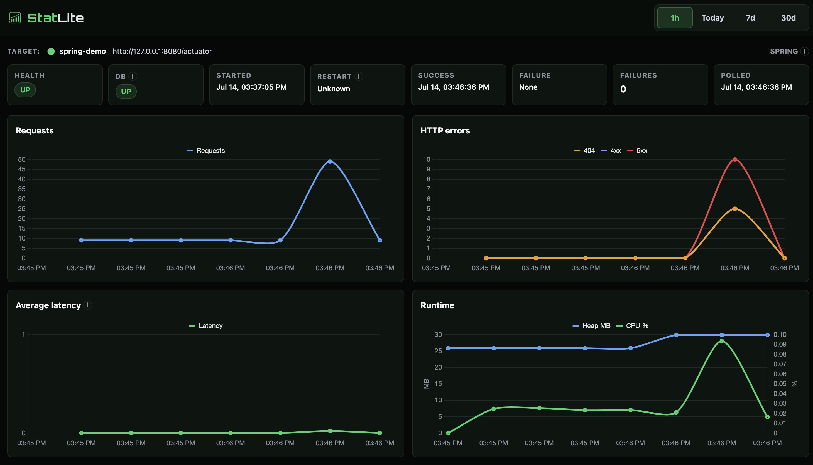

# spring-actuator-demo

This is a standalone Spring Boot application under `examples/spring-actuator-demo/` that StatLite can monitor through Spring Boot Actuator and Micrometer.

## Purpose

This is a minimal Spring Boot application for testing dashboards or collectors that consume Spring Boot Actuator and Micrometer metrics.

## Requirements

- Java 21
- Maven
- `curl`

## Start the application

From this directory:

```bash
mvn spring-boot:run
```

## Verify health

```bash
curl -s http://127.0.0.1:8080/actuator/health
```

## Inspect metrics

```bash
curl -s http://127.0.0.1:8080/actuator/metrics
curl -s http://127.0.0.1:8080/actuator/metrics/http.server.requests
curl -s "http://127.0.0.1:8080/actuator/metrics/jvm.memory.used?tag=area:heap"
curl -s http://127.0.0.1:8080/actuator/metrics/process.cpu.usage
curl -s http://127.0.0.1:8080/actuator/metrics/process.start.time
```

## Generate traffic

```bash
./generate-traffic.sh
```

The script generates successful requests, database requests, slow requests, HTTP 400 responses, HTTP 404 responses, and HTTP 500 responses so the standard `http.server.requests` metric changes visibly.

## Dashboard preview

After the app is running and traffic has been generated, StatLite should look similar to this:



## Test with StatLite

Start the Spring Boot application first:

```bash
mvn spring-boot:run
```

Then, from a terminal where the `statlite` binary is available, start StatLite with the example config in this directory:

```bash
statlite --config ./statlite.yaml
```

Open the dashboard:

```text
http://127.0.0.1:9090
```

Then generate traffic:

```bash
./generate-traffic.sh
```

StatLite polls every 10 seconds, so you may need to wait until the next polling cycle before the charts update.

The dashboard should show:

- application health
- database health
- successful and failed polling attempts
- HTTP request counts
- `400`, `404`, and `500` activity
- average request latency
- JVM heap usage
- process CPU usage, when available
- process start time
- restart detection after the Spring Boot process is restarted

## Restart test

1. Start the Spring Boot application.
2. Start StatLite with `statlite.yaml`.
3. Run `generate-traffic.sh`.
4. Wait for at least one successful StatLite poll.
5. Stop the Spring Boot application.
6. Start the Spring Boot application again.
7. Wait for the next successful StatLite poll.
8. Confirm that StatLite records the restart and does not display negative request-counter deltas.

Do not implement restart detection in the Spring Boot app. It only needs to expose the standard `process.start.time` metric.

## Cleanup

Remove the local StatLite database files with:

```bash
rm -f \
  statlite-spring-demo.sqlite \
  statlite-spring-demo.sqlite-shm \
  statlite-spring-demo.sqlite-wal
```

## Run tests

```bash
mvn test
```

## Security note

- The app binds to `127.0.0.1`.
- Actuator endpoints are intentionally unauthenticated for local testing.
- This configuration is not intended to be exposed publicly.
- Production deployments should use authentication and network restrictions.
